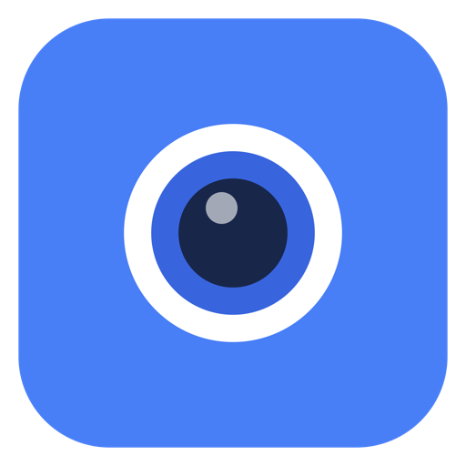
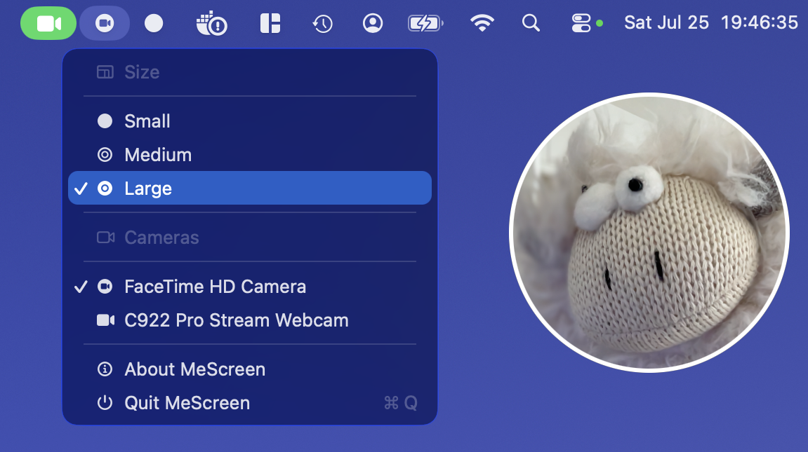

<p align="center">
  
</p>

<h1 align="center">MeScreen</h1>

<p align="center">A floating camera overlay for macOS.</p>



MeScreen puts your camera in a small, draggable circle above other windows. It lives in the menu bar and stays out of the Dock.

## Useful for

- Screen recordings and tutorials
- Presentations and product demos
- Online classes and workshops
- Checking your framing and lighting

## Highlights

- Always-on-top circular camera overlay
- Drag it anywhere and choose from three sizes
- Switch between built-in and external cameras
- Works across Spaces and full-screen apps

## Download and run

[**Download MeScreen v1.0.0 for Apple Silicon →**](https://github.com/alexcybernetic/mescreen/releases/download/v1.0.0/MeScreen-v1.0.0-macOS-arm64.zip)

Requires **macOS 14 or newer**. Unzip the download, move `MeScreen.app` to **Applications**, and allow camera access when asked.

The binary is accompanied by a [SHA-256 checksum](https://github.com/alexcybernetic/mescreen/releases/download/v1.0.0/MeScreen-v1.0.0-macOS-arm64.zip.sha256). Download both files into the same directory and compare their hashes:

```sh
actual="$(shasum -a 256 MeScreen-v1.0.0-macOS-arm64.zip | awk '{print $1}')"
expected="$(awk '{print $1}' MeScreen-v1.0.0-macOS-arm64.zip.sha256)"
[[ "$actual" == "$expected" ]] && echo "Checksum OK" || echo "Checksum mismatch"
```

### If macOS blocks the app

The published build is ad-hoc signed and is not notarized. macOS therefore cannot verify the developer identity. The checksum verifies archive integrity but does not establish a trusted publisher identity.

1. In the warning, choose **Done**, not **Move to Trash**.
2. Open **System Settings → Privacy & Security**.
3. Under **Security**, click **Open Anyway**.
4. Authenticate and confirm **Open**.

## Use

Drag the camera circle to move it. Use the menu-bar icon to change its size, switch cameras, view About, or quit.

## Build from source

Building requires **Xcode 16 or newer**:

```sh
git clone https://github.com/alexcybernetic/mescreen.git
cd mescreen
./build.sh
open Build/MeScreen.app
```

No paid Apple Developer Program membership is required to build from source. The script applies an ad-hoc signature, validates the app's code seal and entitlements, and excludes debugger and unrelated file-access entitlements from Release builds.

Versioned archives and portable SHA-256 checksums are written to `Dist/` only when `HEAD` has an exact `v` tag or `RELEASE_VERSION` is explicitly supplied. The working tree must be clean, and existing release artifacts are never overwritten.

## Privacy

MeScreen works locally. It has no analytics, network access, or recording feature—your camera feed is only displayed on screen.

## License

[MIT](LICENSE)
